## 1. Shape brief (PRODUCT.md-equivalent)

### 1.1 Who this is for

- **Patients & families** in Hapur and surrounding Western UP. Mostly Hindi-first, on mid-tier Android phones, often searching at moments of stress (emergency, admission, lab results, blood bank availability). Many are new to the hospital, brought in by a referring doctor or by a search.
- **Referring physicians** in district hospitals across Western UP looking for a credible tertiary referral.
- **MBBS / PG aspirants and parents** evaluating the medical college: programs, eligibility, fees, faculty, campus, placement.
- **Existing patients** returning for appointment booking, bill payment, lab reports, follow-ups.

### 1.2 Brand voice (three concrete words)

**Dignified. Durable. Lucid.** Address adults as adults. Built like institutional infrastructure, not a fashion label. Information must be findable in seconds.

### 1.3 Register and aesthetic lane

- **Register:** brand (design IS the product; first impression is the deliverable).
- **Lane:** institutional gravitas with a committed deep hospital blue as the brand color. Reference shape: AIIMS / CMC Vellore-style authority, executed at 2026 craft level, with Devanagari treated as a first-class design citizen (not afterthought rendering in default Mangal).

### 1.4 Anti-references

The design must never look like:

- Generic healthcare SaaS (white + teal + soft shadows + rounded icon-cards + smiling stock doctor).
- WordPress hospital template (rotating slider, "Make an Appointment" form on every page, animated counters).
- Indian hospital cliche (red-cross + blue gradient + Times New Roman + Mangal-rendered Hindi).
- Mass General Phillips luxury-hotel feel applied verbatim (wrong audience, would read as cold).
- Editorial-magazine aesthetic (Fraunces italic + drop caps + ruled separators) - this is a hospital, not a magazine.

### 1.5 Color (DESIGN.md core)

Strategy: **Committed**. The deep blue carries 30 to 50 percent of major surfaces; everything else recedes.

- `--ink` = `oklch(0.18 0.04 250)` (deep blue-black, used for body text and headings on light surface)
- `--surface` = `oklch(0.97 0.006 240)` (warm-tinted bone, the page background; never `#fff`)
- `--surface-mute` = `oklch(0.94 0.008 240)` (subtle band differentiation)
- `--brand` = `oklch(0.38 0.12 250)` (deep prussian-leaning hospital blue, the committed color; carries hero, footer, locale switcher, primary buttons)
- `--brand-deep` = `oklch(0.28 0.10 252)` (footer, dark sections)
- `--accent` = `oklch(0.85 0.06 75)` (warm saffron-cream highlight; ≤5 percent of surface; emphasis only)
- `--rule` = `oklch(0.85 0.012 240)` (hairline separators)

No `#000`, no `#fff`. Every neutral is tinted toward the brand hue. Pure light theme, justified by the scene: a worried family member in daylight on a phone in Hapur, or an MBBS aspirant browsing a low-end Android during admission season.

### 1.6 Typography (bilingual, first-class Devanagari)

- **Display (both scripts):** [Tiro Devanagari Hindi](https://fonts.google.com/specimen/Tiro+Devanagari+Hindi) paired with **Tiro Latin**. Designed by John Hudson explicitly for sustained reading of Hindi; matched Latin cut. Used for H1 and H2 at large sizes.
- **Body (both scripts):** [Hind](https://fonts.google.com/specimen/Hind) by Indian Type Foundry. Bilingual Devanagari + Latin matched-design family. Weights 400/500/600/700.
- **No Inter, DM Sans, Plus Jakarta, Outfit, Plex, Fraunces, Playfair, Cormorant.** All reflex-rejected.
- Modular scale, fluid `clamp()`, ratio 1.25 minimum between steps. Devanagari line-height +0.1 over Latin (the script needs more vertical breathing room).
- Hindi headlines should appear at large sizes (not crammed). The Hindi locale is not a cosmetic toggle; it has its own typographic rhythm.

### 1.7 Layout and motion

- **Strict, visible grid** as institutional voice (the Swiss-meets-Indian-civic-form lane done with care). Numbered or labeled sections where appropriate. No centered-stack template hero.
- Asymmetric where it earns it (split hero with statement on left, hero photograph on right).
- No icon-heading-text card grids. Real content blocks.
- Motion is restrained: subtle entrance fades, no parallax, no scroll-triggered theatrics. Hospitals do not perform.
- `grid-template-rows` for collapsible sections, never `height` animations.

### 1.8 Imagery

Brief implies imagery. For the mockup phase, use Unsplash with searches like "north indian hospital corridor", "doctor consulting patient india", "medical students lecture hall", "newborn intensive care unit hands". One decisive photo per major section, alt text in the section's locale. Real institutional photography replaces stock in phase 4.

### 1.9 Bans (project-specific, on top of shared bans)

Side-stripe borders, gradient text, glassmorphism, hero-metric template, identical card grids, modal-as-first-thought, em dashes in copy, monospace-as-tech-shorthand, large rounded icons above every heading, all-caps body, timid palettes, zero imagery, default editorial-magazine reflex.

---

## 2. Information architecture

Two institutions under one site. Top nav makes the fork immediate.

```mermaid
flowchart TB
  Home[Home / locale root]
  Home --> Patients[Patients and Visitors]
  Home --> Academics[Medical College]
  Home --> Institution[The Institution]
  Home --> Quick[Quick actions: appointment, bills, reports, emergency]

  Patients --> Departments[Departments and specialties]
  Patients --> Doctors[Find a doctor]
  Patients --> Centers[Centers of excellence: IVF, Cardiac, Neurosurgery, NICU, Joint replacement]
  Patients --> Care[Patient care: admissions, billing, insurance, what to bring]
  Patients --> Emergency[24x7 emergency and ambulance]
  Patients --> Library[Health library, bilingual]

  Academics --> Programs[Programs: MBBS, PG, allied health, FOGSI, nursing, paramedical]
  Academics --> Admissions[Admissions: eligibility, fees, scholarships, application]
  Academics --> Faculty[Faculty]
  Academics --> Research[Research]
  Academics --> StudentLife[Student life and library]

  Institution --> About[About, history, leadership]
  Institution --> Accreditations[NABH, NABL, NMC affiliations]
  Institution --> News[News and press]
  Institution --> Careers[Careers: clinical, academic, research]
  Institution --> Contact[Contact and locations]
  Institution --> Referring[For referring physicians]
```



Always-visible utility bar (top): Emergency 24x7 number, locale switcher (EN / हिन्दी), search.

Persistent quick actions (mobile sticky, desktop top-right): Book Appointment, Pay Bills, Lab Reports, WhatsApp.

---

## 3. Tech stack and project structure

- **Next.js 15** (App Router, Server Components, Partial Prerendering)
- **TypeScript** strict
- **Tailwind CSS v4** (CSS-first config, OKLCH tokens via `@theme`)
- **shadcn/ui** as primitive layer (Button, Sheet, Dialog, Tabs, Accordion, Command, Form). Restyled to match the design system, never used as default.
- **next-intl** for i18n with `/en` and `/hi` locale routing
- **Payload CMS** self-hosted, Postgres, embedded under `app/(payload)/admin`. Built-in `localization` for EN/HI fields.
- **next/font** for Tiro Devanagari Hindi + Tiro Latin + Hind (subset to required Devanagari + Latin glyph ranges, preload critical weights only)
- **Resend** or SMTP for the appointment / inquiry forms
- **Vercel** or self-host on a Hetzner VPS (Payload + Postgres + Next as one app, easier for the maintainer)

Suggested directory layout:

```text
app/
  (site)/
    [locale]/
      layout.tsx           // sets dir="ltr", html lang, fonts, metadata, nav, footer
      page.tsx             // home
      patients/
        departments/[slug]/page.tsx
        doctors/[slug]/page.tsx
        services/[slug]/page.tsx
        emergency/page.tsx
      academics/
        programs/[slug]/page.tsx
        admissions/page.tsx
        faculty/[slug]/page.tsx
        research/page.tsx
      news/[slug]/page.tsx
      about/page.tsx
      contact/page.tsx
  (payload)/
    admin/[[...segments]]/page.tsx   // Payload admin
    api/[...slug]/route.ts            // Payload REST/GraphQL
components/
  primitives/   // shadcn-derived, restyled
  blocks/       // CMS render blocks (Hero, DepartmentList, DoctorCard, FAQ, RichText...)
  marketing/    // bespoke sections (homepage hero, accreditations strip)
  i18n/         // LocaleSwitcher, useTranslations wrappers, dir helpers
content/
  messages/
    en.json
    hi.json
lib/
  payload.ts    // typed local API client
  seo.ts        // generateMetadata helpers, hreflang, JSON-LD
  fonts.ts      // next/font configuration
payload.config.ts
middleware.ts   // next-intl locale negotiation, default to /hi for India IPs
```

---

## 4. Bilingual strategy (first-class, not bolted on)

- Locale-prefixed routes: `/en/...` and `/hi/...`. No detection at root; root redirects to user's stored locale or geo-default (`/hi` for India).
- `next-intl` for UI strings; Payload's `localization: { locales: ['en', 'hi'], defaultLocale: 'hi' }` for content.
- Every CMS field that holds copy is localized. Doctors, departments, programs, news, pages, FAQs.
- **Typography contract:** in Hindi locale, Devanagari fonts load with priority; line-heights bump +0.1; max-widths shrink slightly (Devanagari is denser per ch).
- **Numerals:** Latin digits in both locales for phone numbers, lab values, prices (matches Indian institutional convention; aids search). Optional Devanagari numerals as a per-section override only where it's editorial.
- **`hreflang` and JSON-LD** hospital schema in both locales; canonical points to current locale.
- **Locale switcher** preserves the current path mapping using Payload's slug localization. `/en/patients/departments/cardiology` ↔ `/hi/patients/departments/hridya-rog-vibhag` (slug-localized via Payload).
- **RTL is not needed** (both scripts are LTR), but `dir` is set explicitly on `<html>`.
- **Search** uses pg_trgm on Postgres for bilingual fuzzy match across both locales.

---

## 5. Payload CMS data model

Collections (each with `localization: true` where copy lives):

- **`pages`** - block-based composer (Hero, Stat strip, RichText, DepartmentList, DoctorList, FAQ, CallToAction, ImageWithText, AccreditationsStrip)
- **`doctors`** - name, qualifications, specialty (relationship), languages, OPD schedule, photo, bio (rich text, localized), credentials (registration number)
- **`departments`** - name, slug, summary, services, head doctor (relationship), photo, longform overview
- **`programs`** - academic programs: MBBS / PG / nursing / FOGSI / paramedical. Eligibility, duration, fees, intake, accreditation, faculty, apply CTA
- **`faculty`** - separate from clinical doctors (some overlap, link both)
- **`news`** - press, announcements, awareness camps, CME events
- **`locations`** - addresses, phones, hours, directions, geo
- **`media`** - image library with focal points and alt text per locale
- **`globals.settings`** - emergency banner copy, primary phones, social, footer
- **`globals.navigation`** - top nav, mega-menu structure, footer links

Access control: public read, authenticated write. Admin editors get role-based access (clinical editor vs. academic editor).

---

## 6. Page templates (high-priority)

- **Home** - split hero with one decisive photograph and a statement of purpose in the active locale; trust strip (NABH, NABL, NMC affiliations); department index (no icon cards - typographic list with hover detail); Centers of Excellence (5 long-form cards with real photography); doctors marquee; news + camps; bilingual emergency / appointment block; campus / college teaser.
- **Department detail** - overview, head of department, doctors in department, services and procedures, FAQs, location and hours, related news.
- **Doctor profile** - photo, name in both scripts, credentials, OPD timings, languages spoken, departments, book appointment.
- **Program detail (academic)** - overview, eligibility, duration, fees, intake, faculty teasers, downloads (prospectus in EN/HI), apply CTA, FAQ.
- **Admissions** - timeline, eligibility table by program, fee structure, scholarships, FAQ, application form.
- **Find a doctor** - filter by specialty, gender, language, OPD day; bilingual fuzzy search.
- **Contact / locations** - addresses, embedded map, department-wise phones (the existing site has 6 separate desks), inquiry form.
- **Emergency** - large phone CTA, ambulance number, what to do, what to bring, directions; print stylesheet.

---

## 7. Performance, accessibility, SEO

- **Targets:** LCP < 2.5s on slow 3G, CLS < 0.05, INP < 200ms. Hapur audience is mostly mid-tier Android on patchy 4G.
- Critical CSS inlined; route-level RSC; static generation for everything except search.
- Devanagari font subset to required glyphs; preload only the active locale's display weight.
- Images via `next/image` AVIF + responsive sizes; LQIP placeholders.
- WCAG 2.2 AA; Devanagari minimum 14px with +0.1 line-height; verified contrast in both palettes.
- JSON-LD: `Hospital`, `MedicalOrganization`, `EducationalOrganization`, `Physician` per doctor profile, `MedicalProcedure`, `BreadcrumbList`.
- `hreflang` per page, sitemap split per locale, robots, RSS for news.
- Click-to-call phone numbers; click-to-WhatsApp on mobile.

---

## 8. Build sequence

The work is broken into explicit todos below. Phase 0 sets up the project; phases 1 to 3 land the design system and home; phases 4 and 5 build content templates; phase 6 wires the CMS; phase 7 adds search, forms, and final polish. After phase 1 (design tokens + home hero) we run an `$impeccable critique` pass to verify the design direction before propagating it across the site.

---

## 9. Open execution decisions (resolve at start of phase 0)

- Hosting target (Vercel + managed Postgres, or single Hetzner/DigitalOcean VPS with Payload + Postgres + Next colocated). Affects Payload deployment shape.
- Real photography availability and timeline. Until phase 4, the build uses Unsplash placeholders with deliberate searches; we replace once the institution provides real assets.
- Logo / wordmark. Greenfield identity means we design a wordmark in phase 1 (Tiro Latin + Tiro Devanagari, "DNH" or full bilingual name treatment).
- Form backend (Resend vs. SMTP via existing enquiry@dnhhapur.com mailbox).
- Domain cutover plan from the existing WordPress site (likely a parallel staging on `new.dnhhapur.com` until launch).